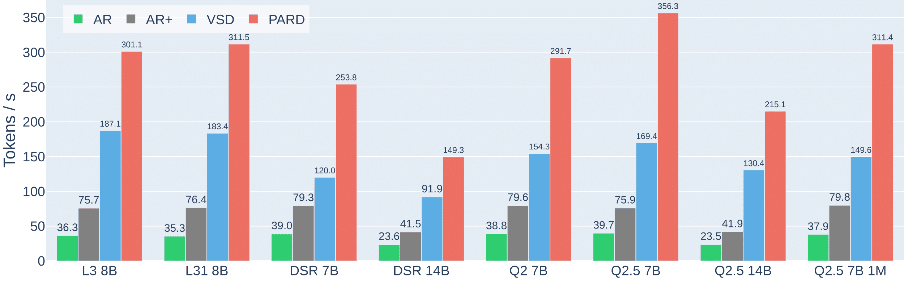

<div align="center">
<h1>PARD: Accelerating LLM Inference with Low-Cost PARallel Draft Model Adaptation</h1>
</div>

<p align="center"> |
<a href="https://arxiv.org/abs/2504.18583"><b>Paper</b></a> | 
<a href="https://www.amd.com/en/developer/resources/technical-articles/accelerating-generative-llms-interface-with-parallel-draft-model-pard.html"><b>Blog</b></a> |
</p>

## Introduction

PARD is a high-performance speculative decoding method that also enables low-cost adaptation of autoregressive draft models into parallel draft models. It offers the following advantages:

- **Low-Cost Training**: PARD adapts AR (autoregressive) draft models into parallel draft models with minimal overhead. Compared to pure AR draft models, PARD achieves an average inference speedup of 1.78×. By introducing a conditional drop-token strategy, PARD improves training efficiency by up to 3× while maintaining the same level of accuracy.

- **Generalizability**: Thanks to its target-independent design, a single PARD draft model can accelerate an entire family of target models. This contrasts with target-dependent approaches such as Medusa and EAGLE, which require retraining or tuning for each new target. As a result, PARD significantly reduces both deployment complexity and adaptation cost.

- **High Performance**: When integrated into an optimized inference framework called Transformers+ PARD delivers up to a 4.08× speedup, with LLaMA3.1 8B reaches a state-of-the-art 311.5 tokens per second. When integrated into vLLM, PARD delivers up to 3.06× speedup, outperforming other speculative decoding methods in vLLM by 1.51×.


<p align="center">
  <picture></picture>
  <br><div align="center" width="90%"><em>AR and AR+ represent baseline auto-regressive generation using Transformers and Transformers+, respectively. VSD denotes vanilla speculative decoding. PARD refers to the proposed method in this work.</em></div><br>
</p>

## Update
- **2026.02.06**: PARD is now officially supported in vLLM!
- **2026.01.26**: PARD is accepted to ICLR'26.
- **2025.10.20**: Support Llama4
- **2025.07.16**: Support Qwen3
- **2025.06.30**: Support vLLM.

## Installation

### Base Docker
```
# rocm
rocm/pytorch:rocm6.3.2_ubuntu22.04_py3.10_pytorch_release_2.5.1_preview

# cuda
nvcr.io/nvidia/pytorch:25.02-py3
```

### Requiremets
```
git clone https://github.com/AMD-AGI/PARD
cd PARD
pip3 install -r requirement.txt --no-build-isolation
```

## Model Weights

| Model Series | Model Name                            | Download      |
|--------------|---------------------------------------|---------------|
| llama3       | PARD-Llama-3.2-1B                     | [🤗 HuggingFace](https://huggingface.co/amd/PARD-Llama-3.2-1B)  |
| llama4       | PARD-Llama-4-1B                       | [🤗 HuggingFace](https://huggingface.co/amd/PARD-Llama-4-1B)  |
| DSR Qwen     | PARD-DeepSeek-R1-Distill-Qwen-1.5B    | [🤗 HuggingFace](https://huggingface.co/amd/PARD-DeepSeek-R1-Distill-Qwen-1.5B) |
| Qwen         | PARD-Qwen2.5-0.5B                     | [🤗 HuggingFace](https://huggingface.co/amd/PARD-Qwen2.5-0.5B) |
| Qwen3        | PARD-Qwen3-0.6B                       | [🤗 HuggingFace](https://huggingface.co/amd/PARD-Qwen3-0.6B) |

## Eval With Transformers+

### Llama3 Series
```
python3 -m pard.infer -c config/eval/llama3_eval.yaml
```

### DeepSeek-R1-Distill-Qwen Series
```
python3 -m pard.infer -c config/eval/dsrq_eval.yaml
```

### Qwen Series
```
python3 -m pard.infer -c config/eval/qwen_eval.yaml
```

### Arguments Description

* **`-k`, `--draft_k`**
  *(default: 12)*
  Specifies the number of draft tokens to be generated in each speculative decoding iteration. Setting this to 0 disables speculative decoding and runs the baseline method instead.

* **`--tokens`**
  *(default: 512)*
  Sets the max number of tokens to during the inference.

* **`-d`, `--draft`**
  *(default: `'qwen_0.5b_pard'`)*
  The name or path of the draft model.

* **`-t`, `--target`**
  *(default: `'qwen_2.5_7b'`)*
  The name or path of the target model.

* **`-b`, `--benchmark`**
  *(default: `'humaneval'`)*
  Specifies the benchmark dataset to use for evaluation. Choices include `humaneval`, `gsm8k` and `math500`.

* **`-ms`, `--model_serie`**
  *(default: None)*
  Model series of target model. Choices include `llama3`, `qwen`, `r1` and `None`. When set to None, the series will be automatically inferred from the target model's name.

* **`--para`**
  *(flag; default: False)*
  Enables the Parallel Draft model mode. When set to False, an autoregressive (AR) Draft model is used instead.

* **`--nc`**
  *(flag; default: False)*
  Disables torch compile.

* **`--maxtune`**
  *(flag; default: False)*
  Enables maxtune for Target model

* **`--max_cache_len`**
  *(default: None)*
  Sets the maximum cache length for the model. If not provided, it defaults to the value of tokens.

## Inference with vllm

**vllm official example:**
- **Test example**: [link](https://github.com/vllm-project/vllm/blob/1363e3d6d5659b58376fa5284afc2c8be548cc9d/tests/v1/e2e/test_spec_decode.py#L679-L692)
- **Related PR**: [link](https://github.com/vllm-project/vllm/pull/32887)

**vllm v0 example (old):**
- **Setup**
```bash
# for VLLM V0
git clone -b model/integrate-pard-0521 https://github.com/zihaoanllm/vllm.git
cd vllm

# Set up using Python-only build
# Other installation methods can be found in the official vLLM documentation.
VLLM_USE_PRECOMPILED=1 pip install --editable .
```

- **Inference**

```bash
python3 -m utils.vllm_infer
```

## Training Example

```
python3 -m pard.train -c config/train/example_qwen.yaml
```

## Citation
```
@article{an2025pard,
  title={PARD: Accelerating LLM Inference with Low-Cost PARallel Draft Model Adaptation},
  author={An, Zihao and Bai, Huajun and Liu, Ziqiong and Li, Dong and Barsoum, Emad},
  journal={arXiv preprint arXiv:2504.18583},
  year={2025}
}
```
