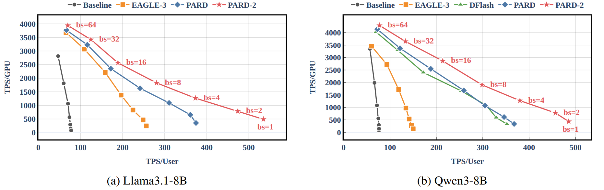

<div align="center">
<h1>PARD</h1>
</div>

<p align="center"> |
<a href="https://arxiv.org/abs/2504.18583"><b>Paper (PARD)</b></a> |
<a href="https://arxiv.org/abs/2605.08632"><b>Paper (PARD-2)</b></a> | 
<a href="https://www.amd.com/en/developer/resources/technical-articles/accelerating-generative-llms-interface-with-parallel-draft-model-pard.html"><b>Blog</b></a> |
</p>

## Introduction

**PARD** is a family of high-performance speculative decoding methods designed to accelerate Large Language Model (LLM) inference with efficient parallel draft models.

### PARD

**PARD** introduces **PARallel Draft** model adaptation, enabling autoregressive (AR) draft models to be converted into parallel draft models at low training cost. It offers the following advantages:

- **Low-Cost Training**: PARD adapts AR draft models into parallel draft models with minimal overhead. By introducing a COnditional Drop-token (COD) strategy, PARD improves draft-model training efficiency by up to **3×** while maintaining strong accuracy.

- **Target Independence**: Thanks to its target-independent design, a single PARD draft model can accelerate an entire family of target models. This contrasts with target-dependent approaches such as Medusa and EAGLE, which require retraining or tuning for each new target model. As a result, PARD significantly reduces deployment complexity and adaptation cost.

- **High Performance**: PARD achieves strong acceleration in optimized inference frameworks. When integrated into vLLM, PARD achieves up to **3.67×** speedup on LLaMA3.1-8B, reaching **264.88 tokens/s**, and outperforms EAGLE-3 by **1.15×**.

### PARD-2

**PARD-2** further advances PARD by introducing a **Target-Aligned Parallel Draft Model** for **dual-mode speculative decoding**. Instead of optimizing draft models only for token-level prediction accuracy, PARD-2 aligns draft-model training with the inference-time objective of maximizing consecutive token acceptance. PARD-2 offers the following advantages:

- **Target-Aligned Optimization**: PARD-2 reformulates the draft-model objective from next-token prediction accuracy to acceptance-length optimization, better matching the draft-then-verify process used during speculative decoding.

- **Confidence-Adaptive Token Optimization**: PARD-2 introduces **Confidence-Adaptive Token (CAT)** optimization, which adaptively reweights tokens according to their contribution to the verification process. This improves the alignment between draft generation and target-model acceptance.

- **Dual-Mode Speculative Decoding**: A single PARD-2 draft model supports both **target-independent** and **target-dependent** modes, combining the deployment flexibility of PARD with the stronger alignment capability of target-aware methods.

- **State-of-the-Art Performance**: Across diverse models and tasks, PARD-2 achieves up to **6.94× lossless acceleration**. On LLaMA3.1-8B, PARD-2 surpasses EAGLE-3 by **1.9×** and PARD by **1.3×**, setting a new performance frontier for speculative decoding.


<p align="center">
  <picture></picture>
  <br><div align="center" width="90%"><em>Throughput and Latency Trade-offs on vLLM. PARD-2 consistently achieves a superior
Pareto frontier across various batch sizes from 1 to 64.</em></div><br>
</p>


## Update
- **2026.05.09**: The PARD-2 paper has been released! Code and model checkpoints will be released soon.
- **2026.02.06**: PARD is now officially supported in vLLM!
- **2026.01.26**: PARD is accepted to ICLR'26.
- **2025.10.20**: Support Llama4
- **2025.07.16**: Support Qwen3
- **2025.06.30**: Support vLLM.

## PARD results on vLLM v1 Engine
- The PARD results reported in the paper were obtained with vLLM v0. The table below presents the results on vLLM v1, which achieve higher speedups.
- The vLLM version used is v0.16.0 (V1 engine). For EAGLE3, Llama 3.1 8B and Llama 3.3 70B use the official EAGLE3 model weights, while Qwen3 8B uses the AngelSlim/Qwen3-8B_eagle3 model weights. Qwen3 was evaluated in no-thinking mode, and the optimal draft_k was selected for each model and task.

| method   | target model | framework     | device | humaneval tps | humaneval speedup | gsm8k tps | gsm8k speedup | mt_bench tps | mt_bench speedup | average tps | average speedup |
|----------|--------------|---------------|--------|---------------|-------------------|-----------|---------------|--------------|------------------|-------------|-----------------|
| Baseline | L3.1 8B      | vllm-v0.16.0  | A100   | 78.43         | 1.00              | 78.43     | 1.00          | 78.37        | 1.00             | 78.41       | 1.00            |
| EAGLE3   | L3.1 8B      | vllm-v0.16.0  | A100   | 245.10        | 3.13              | 204.08    | 2.60          | 189.39       | 2.42             | 212.86      | 2.71            |
| PARD     | L3.1 8B      | vllm-v0.16.0  | A100   | **373.13**    | **4.76**          | **313.48**| **4.00**      | **213.22**   | **2.72**         | **299.94**  | **3.83**        |
| Baseline | Q3 8B        | vllm-v0.16.0  | A100   | 76.51         | 1.00              | 76.57     | 1.00          | 76.39        | 1.00             | 76.49       | 1.00            |
| EAGLE3   | Q3 8B        | vllm-v0.16.0  | A100   | 160.51        | 2.10              | 146.63    | 1.91          | 127.06       | 1.66             | 144.74      | 1.89            |
| PARD     | Q3 8B        | vllm-v0.16.0  | A100   | **386.10**    | **5.05**          | **336.70**| **4.40**      | **192.31**   | **2.52**         | **305.04**  | **3.99**        |
| Baseline | l3.3 70B     | vllm-v0.16.0  | H20    | 70.08         | 1.00              | 70.92     | 1.00          | 70.97        | 1.00             | 70.66       | 1.00            |
| EAGLE3   | l3.3 70B     | vllm-v0.16.0  | H20    | 251.89        | 3.59              | 208.33    | 2.94          | 187.27       | 2.64             | 215.83      | 3.06            |
| PARD     | l3.3 70B     | vllm-v0.16.0  | H20    | **377.36**    | **5.38**          | **320.51**| **4.52**      | **191.57**   | **2.70**         | **296.48**  | **4.20**        |

## Installation

### Base Docker
```
# rocm
rocm/pytorch:rocm6.3.2_ubuntu22.04_py3.10_pytorch_release_2.5.1_preview

# cuda
nvcr.io/nvidia/pytorch:25.02-py3
```

### Requirements
```
git clone https://github.com/AMD-AGI/PARD
cd PARD
pip3 install -r requirement.txt --no-build-isolation
```

## Model Weights

| Model Series | Model Name                            | Download      |
|--------------|---------------------------------------|---------------|
| llama3       | PARD-Llama-3.2-1B                     | [🤗 HuggingFace](https://huggingface.co/amd/PARD-Llama-3.2-1B)  |
| llama4       | PARD-Llama-4-1B                       | [🤗 HuggingFace](https://huggingface.co/amd/PARD-Llama-4-1B)  |
| DSR Qwen     | PARD-DeepSeek-R1-Distill-Qwen-1.5B    | [🤗 HuggingFace](https://huggingface.co/amd/PARD-DeepSeek-R1-Distill-Qwen-1.5B) |
| Qwen         | PARD-Qwen2.5-0.5B                     | [🤗 HuggingFace](https://huggingface.co/amd/PARD-Qwen2.5-0.5B) |
| Qwen3        | PARD-Qwen3-0.6B                       | [🤗 HuggingFace](https://huggingface.co/amd/PARD-Qwen3-0.6B) |

## Eval With Transformers+

### Llama3 Series
```
python3 -m pard.infer -c config/eval/llama3_eval.yaml
```

### DeepSeek-R1-Distill-Qwen Series
```
python3 -m pard.infer -c config/eval/dsrq_eval.yaml
```

### Qwen Series
```
python3 -m pard.infer -c config/eval/qwen_eval.yaml
```

### Arguments Description

* **`-k`, `--draft_k`**
  *(default: 12)*
  Specifies the number of draft tokens to be generated in each speculative decoding iteration. Setting this to 0 disables speculative decoding and runs the baseline method instead.

* **`--tokens`**
  *(default: 512)*
  Sets the max number of tokens to during the inference.

* **`-d`, `--draft`**
  *(default: `'qwen_0.5b_pard'`)*
  The name or path of the draft model.

* **`-t`, `--target`**
  *(default: `'qwen_2.5_7b'`)*
  The name or path of the target model.

* **`-b`, `--benchmark`**
  *(default: `'humaneval'`)*
  Specifies the benchmark dataset to use for evaluation. Choices include `humaneval`, `gsm8k` and `math500`.

* **`-ms`, `--model_serie`**
  *(default: None)*
  Model series of target model. Choices include `llama3`, `qwen`, `r1` and `None`. When set to None, the series will be automatically inferred from the target model's name.

* **`--para`**
  *(flag; default: False)*
  Enables the Parallel Draft model mode. When set to False, an autoregressive (AR) Draft model is used instead.

* **`--nc`**
  *(flag; default: False)*
  Disables torch compile.

* **`--maxtune`**
  *(flag; default: False)*
  Enables maxtune for Target model

* **`--max_cache_len`**
  *(default: None)*
  Sets the maximum cache length for the model. If not provided, it defaults to the value of tokens.

## Inference with vLLM

PARD has already been integrated into vLLM. Official example: [Document](https://docs.vllm.ai/en/latest/features/speculative_decoding/parallel_draft_model/?h=pard#parallel-draft-models)


## Training Example

```
python3 -m pard.train -c config/train/example_qwen.yaml
```

## Citation
```
@article{an2025pard,
  title={PARD: Accelerating LLM Inference with Low-Cost PARallel Draft Model Adaptation},
  author={An, Zihao and Bai, Huajun and Liu, Ziqiong and Li, Dong and Barsoum, Emad},
  journal={arXiv preprint arXiv:2504.18583},
  year={2025}
}
```
